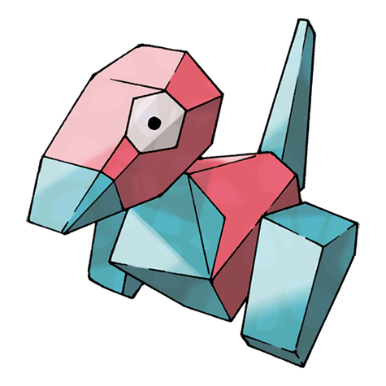
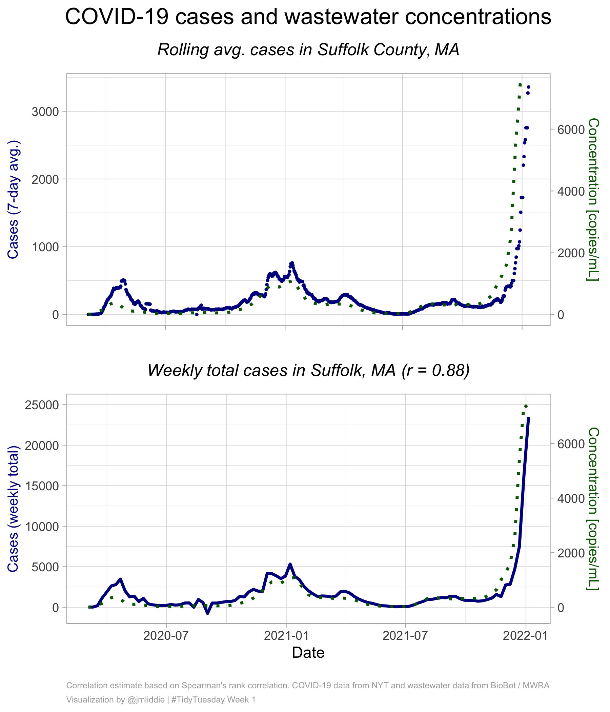
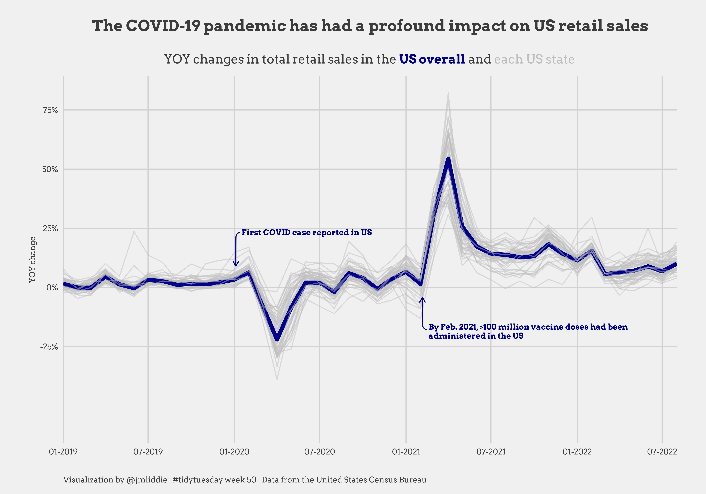
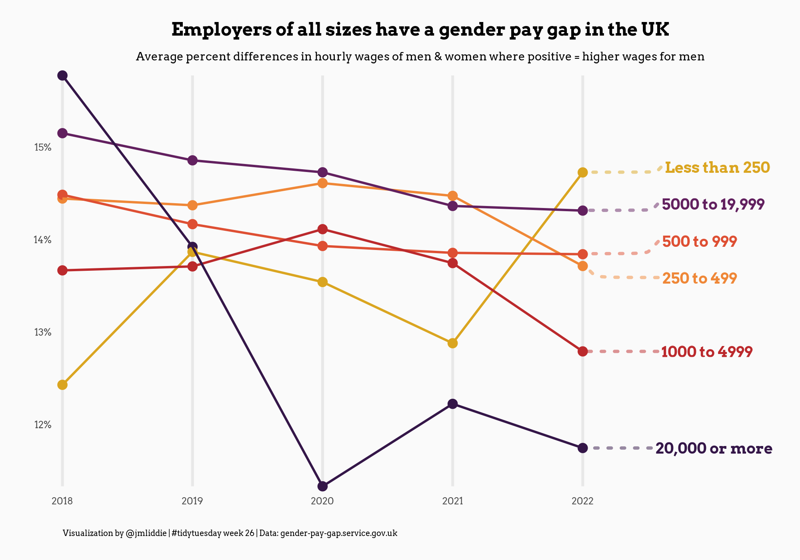
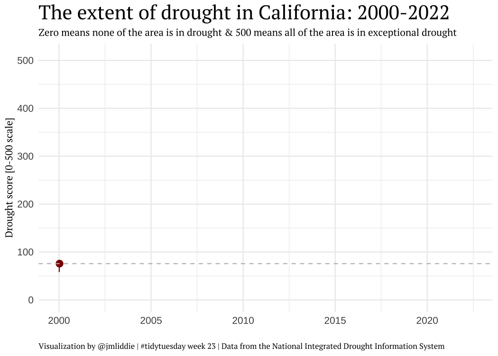
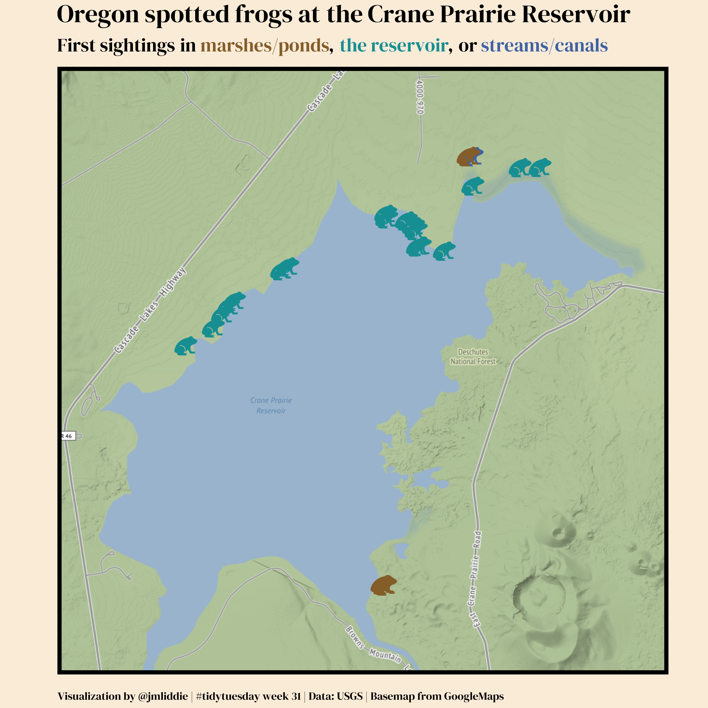
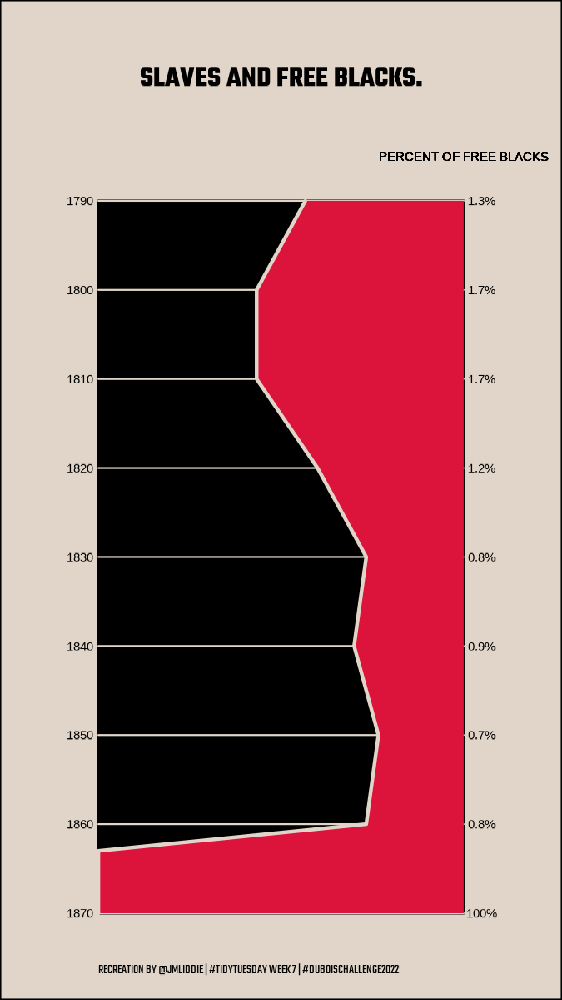
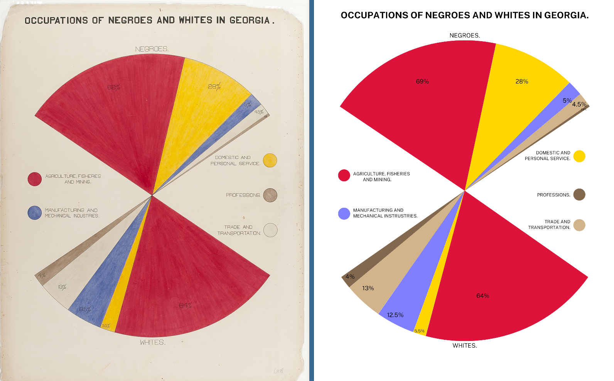
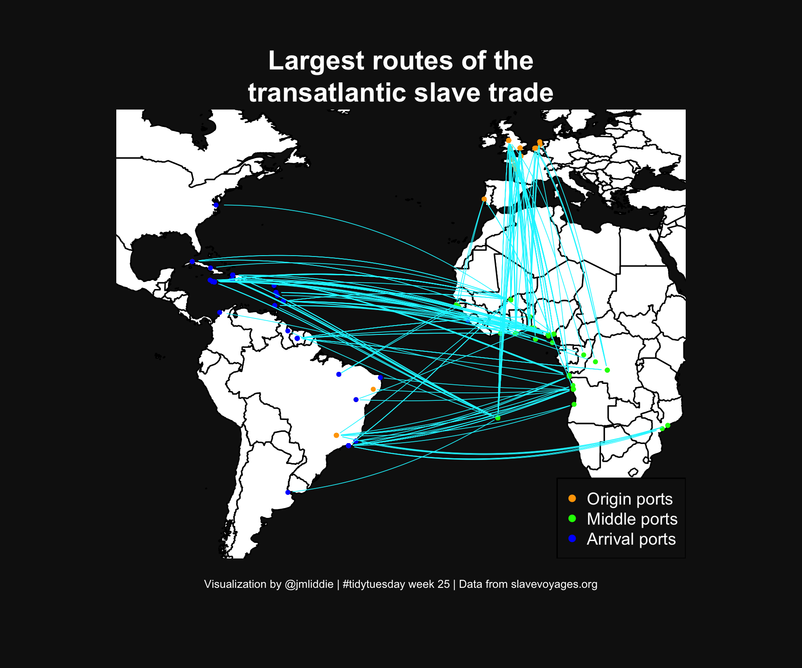
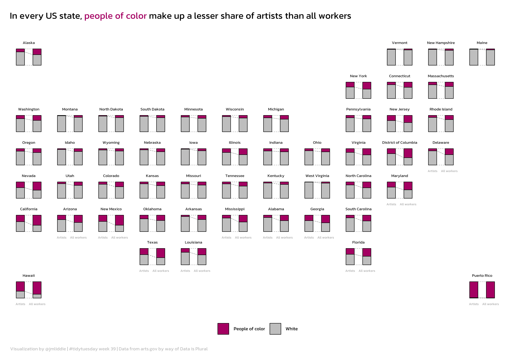

## Outline for today

-   **#tidytuesday: a weekly social data project**
    -   #tidytuesday as helpful, fun practice
    -   My experience with #tidytuesday
-   Geofacet-ing in R
-   Live walkthrough with unregulated drinking water contaminant monitoring data
-   Q&A and summary

## What is #tidytuesday?

-   #tidytuesday is a weekly social data project organized by the [Data Science Learning Community](https://dslc.io/) since 2018

-   Each Monday, a curated dataset is posted to their [Github repo](https://github.com/rfordatascience/tidytuesday)

-   Participants explore the data and share visualizations on social media (formerly on Twitter, now Bluesky)

{width="420"}

## Some other notes on TidyTuesday

-   Participants also encouraged to share code. This is nice since there are some very experienced R users with public TidyTuesday portfolios!
-   The focus is on **exploring** data, rather than establishing causal relationships.
-   Participants can also submit datasets for future weeks

## Past example datasets

-   Bob Ross paintings

-   Weekly US gas prices

-   *Stranger Things* dialogue

-   A dataset of all Pokemon and their stats (available from the `pokemon` package)

{width="200"}

## My experience with TidyTuesday

-   I participated first in 2022 as a way to improve my data visualization skills
-   Also enjoyed the community
-   My full portfolio is available [here](https://github.com/jahredwithanh/tidytuesday/tree/main)

## My very first plot

<small>Key packages: `cowplot`, `ggtext`</small>

{fig-align="center" width="550"}

## Other examples (pt 1)

<small>Key packages: `showtext`, `ggrepel`</small>

{fig-align="center"}

## Other examples (pt 2)

<small>Key packages: `showtext`, `ggrepel`</small>

{fig-align="center"}

## Other examples (pt 3)

<small>Key packages: `gganimate`, `ggtext` </small>

{fig-align="center"}

## Other examples (pt 4)

<small>Key packages: `sf`, `ggimage`, `ggmap` </small>

{fig-align="center"}

## WEB Du Bois data portraits (pt 1)

{fig-align="center"}

## WEB Du Bois data portraits (pt 2)

{fig-align="center"}

## Other examples (pt 5)

<small>Key packages: `geosphere`, `ggmap` </small>

{fig-align="center"}

## Other examples (pt 6)

{fig-align="center" width="5300"}

## What is `geofacet`?
